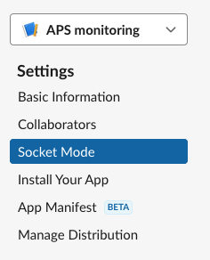
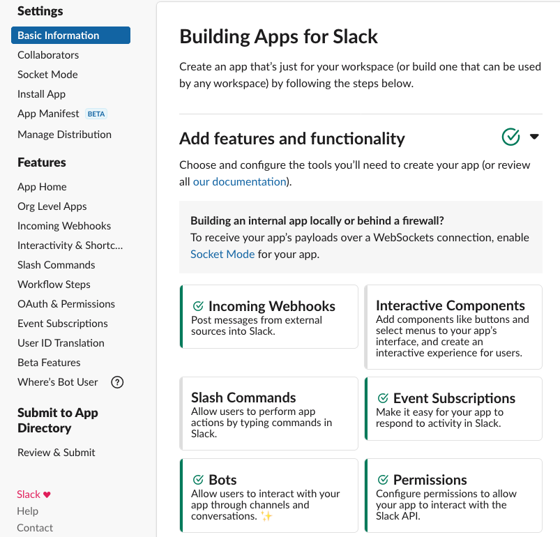

=============
APS Slack bot
=============

Usage
=====

Slack bot automatical respond to predefined keywords, i.e. **ring**, **energ**, **users** etc., returning a list of PV name/value associated with that keywords. 

Starting the slack bot server:

::

    $ slackbot start --beamline 2-bm --channel-name automated
      Bolt app is running!

for help::

    slackbot start -h
    usage: slackbot start [-h] [--beamline {None,2-bm,7-bm,8-id,20-bm,29-id,32-id}] [--channel-name {automated,20-bm}] [--config FILE] [--verbose]

    optional arguments:
      -h, --help            show this help message and exit
      --beamline {None,2-bm,7-bm,8-id,20-bm,29-id,32-id}
                            This parameter is used to select the pv-x-y.json file, e.g. pv-2-bm.json. This file must be created in the slackbot/data directory (default: None)
      --channel-name {automated,20-bm}
                            Name of the slack rob channel (default: automated)
      --config FILE         File name of configuration (default: /home/beams/USER2BMB/slack.conf)
      --verbose             Verbose output (default: True)

then go to the authorized slack channel and type::

	help

and select any of the available options:

.. image:: docs/source/img/ring.png
    :width: 30%
    :align: center

.. image:: docs/source/img/user.png
    :width: 30%
    :align: center

.. image:: docs/source/img/detector.png
    :width: 30%
    :align: center

If an EPICS PV is not available slack with reply with::

	PV 2bmb:TomoScan:RotationStart" is not connected

also the slackbot console logger will report the same:

Installation
============

Pre-requisites
--------------

Read the `Getting started with Bolt for Python <https://slack.dev/bolt-python/tutorial/getting-started>`_  guide and `create a Slack app <https://api.slack.com/apps/new>`_ 

.. image:: docs/source/img/create_app.png
    :width: 45%
    :align: center

Select **From scratch** and follow the on-screen instructions.

Mode
----

Select **Socket Mode** 

.. image:: docs/source/img/socket_mode_02.png
    :width: 45%
    :align: center

- Enable Socket Mode 
- Choose Token Name (e.g. MyToken)  
- Click “Generate” 

.. warning:: It is important to treat the **OAuth Token** as a password and never include it in your code. One option is to set it as and environment variable. To do this, copy token xapp-1- in a file in your user home directory e.g.::

    ~/.slackenv

as APP_TOKEN=xapp-1-........

Features and functionalities
----------------------------

Add features and functionalities (enable all those that are green)

- Incoming webhooks (this allows your bot to post messages and files in the chat; note that the green check mark on the screen shot above does not appear right away, but at some point later in the process)

- Event subscription; Subscribe to bot events with “Add Bot User Event”:

.. image:: docs/source/img/event_subscription.png
    :width: 45%
    :align: center

Scopes
------

Once the Slack app is created you need to set the Slack app capabilities and permissions. These are called `scopes <https://api.slack.com/scopes>`_ and can be set accessing the Bot Token Scopes under the  **OAuth&Permissions** tab at:

.. image:: docs/source/img/features.png
    :width: 15%
    :align: center

and selecting the following:

.. image:: docs/source/img/scopes.png
    :width: 45%
    :align: center

Once this is done, select the **Install to Workspace** to obtain the **Bot User OAuth Token** and copy it in::

    ~/.slackenv

as BOT_TOKEN=xoxb-........

Finally you need invite the Slack app to a specific slack channel:

.. image:: docs/source/img/invite.png
    :width: 60%
    :align: center

Installing from source
======================

In a prepared virtualenv or as root for system-wide installation clone the 
`slackbot <https://github.com/xray-imaging/slack-aps.git>`_ from `GitHub <https://github.com>`_ repository

::

    $ git clone https://github.com/xray-imaging/slack-aps.git slack-aps

Beamline customization
----------------------

Before installing slack-aps, customize for a specific beamline editing the pv dictionary contained in pv.json file::

    $ cd slack-aps/slackbot/data/
    $ more pv.json

This file is formatted as:

+---------------------+----------------------+---------------------------------------------------------------------------+
|slack query keyword  | {slack response label 1 : "epics PV name 1" ,  slack response label 2 : "epics PV name 2", etc.} | 
+---------------------+----------------------+---------------------------------------------------------------------------+

e.g.::

    {"ring": {"s_current": "S:SRcurrentAI", "shutter_status": "PA:02BM:STA_A_FES_OPEN_PL", "acis_shutter_permit": "ACIS:ShutterPermit", "s_desired_mode": "S:DesiredMode"},
    {"energy": {"energy": "2bma:TomoScan:Energy", "energy_mode": "2bma:TomoScan:EnergyMode", "filters": "2bma:TomoScan:Filters"}.
    ....

To install slackbot, run::

    $ cd slack-aps
    $ python setup.py install

Dependencies
============

Install the following package::

    $ pip install python-dotenv
    $ pip install slack-bolt
    $ pip install pyepics
